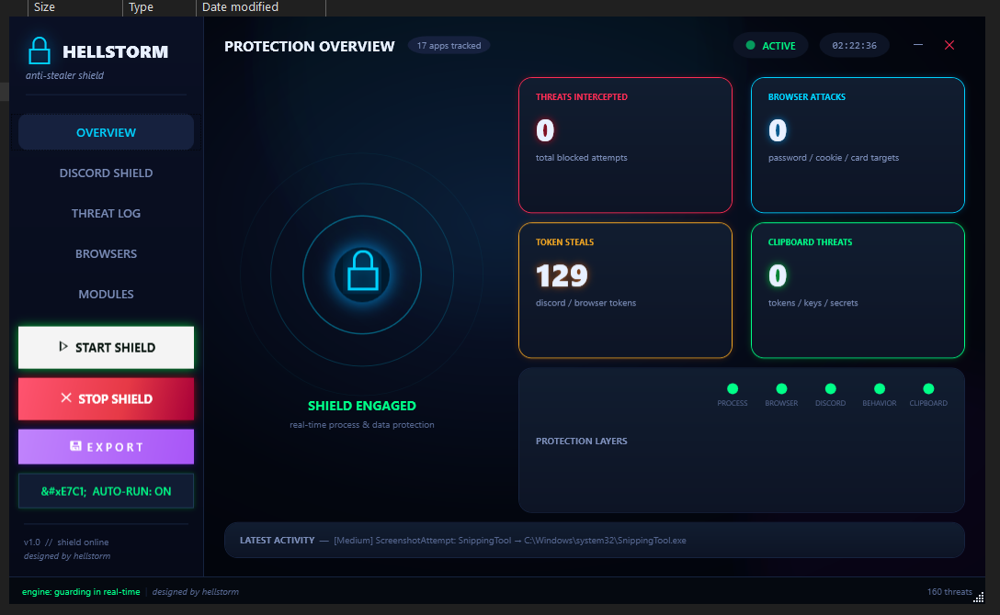
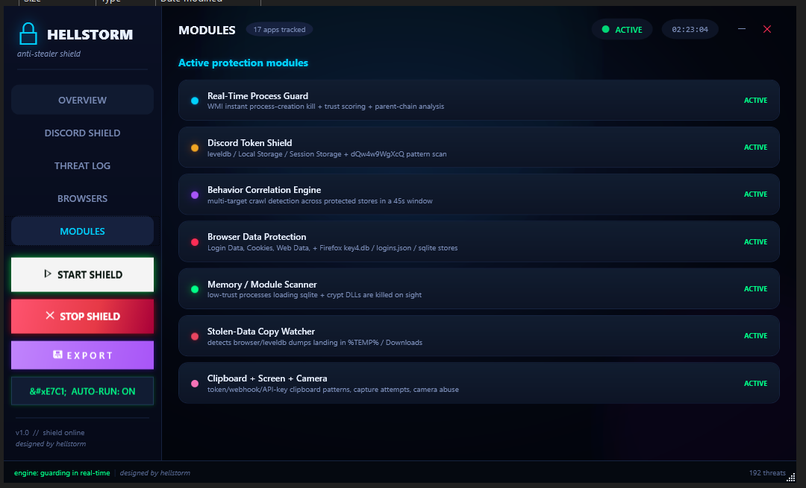

<div align="center">

# HellStorm — StopStealer

**Real-time token-grabber & infostealer blocker for Windows, built by Team HellStorm.**

Sits in the tray, watches your browser and Discord profiles, scans running processes
down to raw memory, and kills grabbers *before* they can phone home with your tokens.



</div>

---

## Why

Discord and browser token grabbers are usually tiny scripts or one-shot executables
that only *read* files — they never write, so classic file-watchers miss them.
HellStorm blocks them anyway, using three independent layers:

| Layer | What it catches |
|-------|-----------------|
| **Memory signature scan** | Token dump prefixes (`dQw4w9WgXcQ:`), webhook URLs, `CryptUnprotectData`/`os_crypt` calls, `users/@me` probes — found live in process memory, in plain text **or** UTF-16. |
| **Behavioral + WMI guard** | New suspicious processes, script interpreters running from temp/downloads, HWID harvesting (`wmic csproduct get uuid`), DPAPI usage by low-trust processes. |
| **Browser/Discord profile monitor** | File-system events on LevelDB / Local State / Cookies, with the accessor attributed and verified before any action. |

> Every block is live: kill + quarantine of the offending process, plus a
> persistent log you can read in the app's Threat Log tab.

## Screenshots




## Features

- Signature check on every launch — the launcher verifies the exe is signed by
  the HellStorm certificate and aborts if the binary has been touched.
- Start / Stop protection anytime, from the dashboard.
- **Auto-run with Windows** — one click registers the launcher in
  `HKCU\...\Run` (optionally through the signed **hellstorm.bat** so the
  signature test still runs at boot).
- Live counters: threats blocked, token grabbers, webhooks, crypto decrypt
  attempts, token steals prevented.
- Dark glass WPF dashboard — CPU/GPU/RAM gauges, recent-threat feed, per-layer
  status toggle.

## How to run

Double-click **hellstorm.bat** (in the repo root, next to `bin\`). It runs the
certificate + integrity test, then launches the app under a fresh random process
name (each launch gets a new one) from a private folder under `%TEMP%`. You can
pass arguments through:

```bat
hellstorm.bat                 :: normal launch
hellstorm.bat --autostart     :: engage protection and start minimized
```

### Register auto-start (optional, still via the bat)

```bat
reg add "HKCU\Software\Microsoft\Windows\CurrentVersion\Run" /v hellstorm /t REG_SZ ^
 /d "cmd /c \"\"C:\HellStorm\hellstorm.bat\" --autostart\"" /f
```

## Requirements

- Windows 10/11, 64-bit
- .NET 8 Desktop Runtime
- An administrator account is **not** required (user-level protection)

## Source layout

The full source lives in its own folder:

```
Source/
  StopStealer.sln           # Core + Service + GUI
  StopStealer.Core/         # engine: memory scanner, process guard,
                            #   browser/discord protector, behavior engine, logging
  StopStealer.Service/      # optional Windows background worker
  StopStealer.GUI/          # WPF dashboard (Focus of this project)
```

## Build from source

```bash
dotnet build Source\StopStealer.sln -c Release
```

> The signed runtime payload is shipped in `bin\`. If you rebuild, re-sign the
> exe with your own `hellstorm.cer` (or the private key of this certificate),
> otherwise the launcher will refuse to run it.

## Software integrity

`hellstorm.cer` contains the HellStorm code-signing certificate. `check-signature.ps1`
compares the exe's signature thumbprint against it on every launch. If the digest
differs, the app refuses to run — a clean way to prove you have the untouched release.

## Scope & safety

HellStorm is a **defensive** tool. Use it to protect machines you own or are
authorized to protect. It does not install drivers, does not phone home, and it
keeps all logs local. It is distributed as-is, for security research and
self-defense.

## Credits

Designed, engineered and polished by **GOLEM**.

## License

MIT — see [LICENSE](LICENSE).
